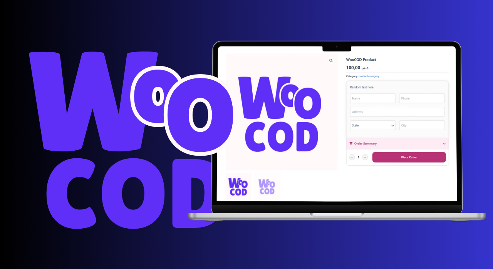

# WooCOD - Direct COD Checkout for WooCommerce

**WooCOD** is a lightweight WordPress plugin that simplifies the checkout experience for Cash on Delivery (COD) orders in WooCommerce. It removes unnecessary fields and redirects customers directly to a thank-you page — no payment gateways, no friction.

---

 

---

## 🚀 Features

- One-click COD checkout (no cart or payment step)
- Optimized for mobile speed and conversions
- Bypasses default WooCommerce payment steps
- Easy to install, no configuration needed
- Works out of the box with most themes

---

## 📦 Installation

1. Download the plugin as a ZIP from the [Releases](https://github.com/MALKIabdessamad/WooCOD/releases) tab (or clone the repo).
2. In your WordPress dashboard:
   - Go to **Plugins > Add New > Upload Plugin**
   - Upload the ZIP file and activate it
3. That's it — WooCOD is now active!

---

## 🌍 Use Case

Ideal for **COD-focused businesses** in markets like Morocco, India, Egypt, and others where instant orders are critical and traditional checkout flows reduce conversions.

---

## ⚠️ Requirements

- WordPress 5.0+
- WooCommerce 4.0+
- PHP 7.2+

---

## 📄 License

This project is open-source under the [MIT License](LICENSE).

---

## 🙌 Contributing

Contributions, issues, and feature requests are welcome!  
Feel free to fork this repo and submit a pull request.

---

## 🔗 Links

- 🧑‍💻 Developer: [Abdessamad Malki](https://github.com/MALKIabdessamad)

---
